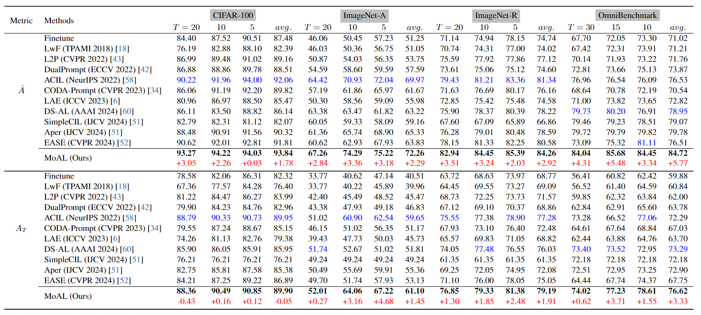

## Knowledge Memorization and Rumination for Pre-trained Model-based Class-Incremental Learning
<p align="center">

</p>


## Abstract
Class-Incremental Learning (CIL) enables models to continuously learn new classes while mitigating catastrophic forgetting. Recently, Pre-Trained Models (PTMs) have greatly enhanced CIL performance, even when fine-tuning is limited to the first task. This advantage is particularly beneficial for CIL methods that freeze the feature extractor after first-task fine-tuning, such as analytic learning-based approaches using a least squares solution-based classification head to acquire knowledge recursively. In this work, we revisit the analytical learning approach combined with PTMs and identify its limitations in adapting to new classes, leading to sub-optimal performance. To address this, we propose the **Mo**mentum-based  **A**nalytical **L**earning (**MoAL**) approach. MoAL achieves robust knowledge memorization via an analytical classification head and improves adaptivity to new classes through momentum-based adapter weight interpolation, also leading to forgetting outdated knowledge. Importantly, we introduce a knowledge rumination mechanism that leverages refined adaptivity, allowing the model to revisit and reinforce old knowledge, thereby improving performance on old classes. MoAL facilitates the acquisition of new knowledge and consolidates old knowledge, achieving a win-win outcome between plasticity and stability. Extensive experiments on multiple datasets and incremental settings demonstrate that MoAL significantly outperforms current state-of-the-art methods.

## Quantitive Comparisions with SOTA methods
<p align="center">

</p>

Following the widely used benchmarks，two metrics are adopted for evaluation. The overall performance is evaluated by the average incremental accuracy $\bar{A}(\%): \bar{A}=\frac{1}{T} \sum_{t=1}^T A_t$ where $T$ and $A_t$ respectively denote the number of incremental tasks and the test accuracy on all seen classes at task $t$. Another metric is the last-task accuracy $A_T(\%)$, which denotes the final average accuracy on all classes.

In Table, we compare MoAL with several state-of-the-art (SOTA) methods. Notably, the non-PTM-based ACIL, benefiting from its recursive structure, achieves competitive results relative to the PTM-optimized EASE, highlighting the strong compatibility between analytical learning-based CIL methods and PTMs. However, MoAL outperforms all baselines in both $\bar{A}(\%) and $A_T(\%)$ across nearly all datasets and settings. In particular, on datasets that differ from the pre-training data, such as ImageNet-A and ImageNet-R, MoAL surpasses the best baseline by an average of 2.29\% and 2.92\% in $\bar{A}(\%), respectively. Furthermore, our method demonstrates minimal performance degradation as the number of tasks increases.  It's worth note that ACIL's final accuracy on CIFAR-100 is close to MoAL's, due to the inherent generalization capabilities of PTMs on this dataset, even without continual adaptation. However, on more challenging datasets like ImageNet-A and ImageNet-R, MoAL significantly outperforms ACIL, thanks to its enhanced PTM adaptivity, which ensures superior stability and plasticity. These trends are also reflected in the accuracy curves shown in Figure~\ref{fig:curve}. These comparisons highlight the value of our method, particularly when downstream datasets differ significantly from pre-trained data, showcasing its strong generalization across diverse domains. 

### Run experiment
To get started, set up a conda environment and install the requirements listed by our repo.

```bash
conda env create -f environment.yml
```
### Datasets
We have implemented the pre-processing datasets as follows:

- **CIFAR100**: will be automatically downloaded by the code.
- **ImageNet-R**: Google Drive: [link](https://drive.google.com/file/d/1SG4TbiL8_DooekztyCVK8mPmfhMo8fkR/view?usp=sharing) or Onedrive: [link](https://entuedu-my.sharepoint.com/:u:/g/personal/n2207876b_e_ntu_edu_sg/EU4jyLL29CtBsZkB6y-JSbgBzWF5YHhBAUz1Qw8qM2954A?e=hlWpNW)
- **ImageNet-A**: Google Drive: [link](https://drive.google.com/file/d/19l52ua_vvTtttgVRziCZJjal0TPE9f2p/view?usp=sharing) or Onedrive: [link](https://entuedu-my.sharepoint.com/:u:/g/personal/n2207876b_e_ntu_edu_sg/ERYi36eg9b1KkfEplgFTW3gBg1otwWwkQPSml0igWBC46A?e=NiTUkL)
- **OmniBenchmark**: Google Drive: [link](https://drive.google.com/file/d/1AbCP3zBMtv_TDXJypOCnOgX8hJmvJm3u/view?usp=sharing) or Onedrive: [link](https://entuedu-my.sharepoint.com/:u:/g/personal/n2207876b_e_ntu_edu_sg/EcoUATKl24JFo3jBMnTV2WcBwkuyBH0TmCAy6Lml1gOHJA?e=eCNcoA)
- **Car196**: [link](https://github.com/jhpohovey/StanfordCars-Dataset)
- **CUB**: [link](https://www.vision.caltech.edu/datasets/cub_200_2011/)

### Pre-trained weights

- [Sup-21K VIT](https://storage.googleapis.com/vit_models/imagenet21k/ViT-B_16.npz)
- [iBOT](https://lf3-nlp-opensource.bytetos.com/obj/nlp-opensource/archive/2022/ibot/vitb_16/checkpoint_teacher.pth)
- [DINO](https://dl.fbaipublicfiles.com/dino/dino_vitbase16_pretrain/dino_vitbase16_pretrain.pth)  

When training , you should specify the folder of your dataset in `utils/data.py`.

```python
  def download_data(self):
     assert 0,"You should specify the folder of your dataset"
     train_dir = '[DATA-PATH]/train/'
     test_dir = '[DATA-PATH]/val/'
```

When using the pre-trained weights of iBOT and DINO, you should download the corresponding pre-trained weights to the **Moal/checkpoints/** folder.

```python
  def vit_base_patch16_224_adapter_dino(pretrained=False, **kwargs):
      model = VisionTransformer(patch_size=16, embed_dim=768, depth=12, num_heads=12, mlp_ratio=4, qkv_bias=True,
          norm_layer=partial(nn.LayerNorm, eps=1e-6), **kwargs)
      ckpt = torch.load('Your_path', map_location='cpu')

  def vit_base_patch16_224_adapter_ibot(pretrained=False, **kwargs):
      model = vit_base_patch16_224_adapter(False, **kwargs)
      ckpt = torch.load('Your_path', map_location='cpu')['state_dict']
```
### To Train

```bash
python main.py --config=exps\MoAL_[dataset_name].json
```


## **Acknowledgments**


We thank the following repos providing helpful components/functions in our work.

- [PyCIL](https://github.com/G-U-N/PyCIL)
- [RevisitingCIL](https://github.com/zhoudw-zdw/RevisitingCIL)
- [l2p-pytorch](https://github.com/JH-LEE-KR/l2p-pytorch)
- [CODA-Prompt](https://github.com/GT-RIPL/CODA-Prompt)
- [LAMDA-PILOT](https://github.com/sun-hailong/LAMDA-PILOT)

