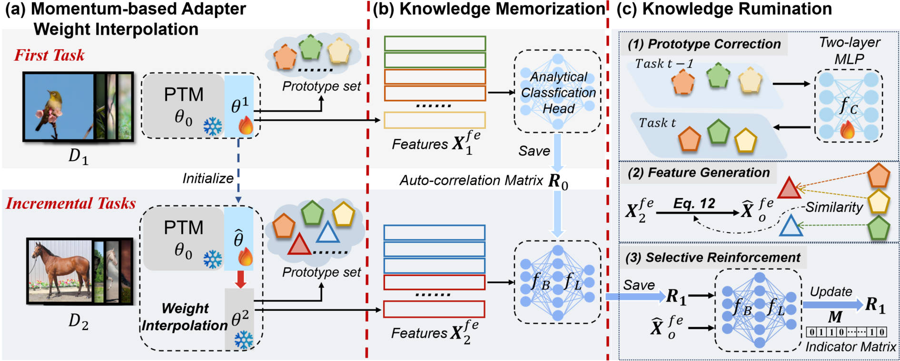

## Knowledge Memorization and Rumination for Pre-trained Model-based Class-Incremental Learning
<p align="center">

</p>


## Abstract
Class-Incremental Learning (CIL) enables models to continuously learn new classes while mitigating catastrophic forgetting. Recently, Pre-Trained Models (PTMs) have greatly enhanced CIL performance, even when fine-tuning is limited to the first task. This advantage is particularly beneficial for CIL methods that freeze the feature extractor after first-task fine-tuning, such as analytic learning-based approaches using a least squares solution-based classification head to acquire knowledge recursively. In this work, we revisit the analytical learning approach combined with PTMs and identify its limitations in adapting to new classes, leading to sub-optimal performance. To address this, we propose the **Mo**mentum-based  **A**nalytical **L**earning (**MoAL**) approach. MoAL achieves robust knowledge memorization via an analytical classification head and improves adaptivity to new classes through momentum-based adapter weight interpolation, also leading to forgetting outdated knowledge. Importantly, we introduce a knowledge rumination mechanism that leverages refined adaptivity, allowing the model to revisit and reinforce old knowledge, thereby improving performance on old classes. MoAL facilitates the acquisition of new knowledge and consolidates old knowledge, achieving a win-win outcome between plasticity and stability. Extensive experiments on multiple datasets and incremental settings demonstrate that MoAL significantly outperforms current state-of-the-art methods.

## Installation and Usage

### Run experiment
To get started, set up a conda environment and install the requirements listed by our repo.

```bash
conda env create -f environment.yml
```
### Datasets
We have implemented the pre-processing datasets as follows:

- **CIFAR100**: will be automatically downloaded by the code.
- **ImageNet-R**: Google Drive: [link](https://drive.google.com/file/d/1SG4TbiL8_DooekztyCVK8mPmfhMo8fkR/view?usp=sharing) or Onedrive: [link](https://entuedu-my.sharepoint.com/:u:/g/personal/n2207876b_e_ntu_edu_sg/EU4jyLL29CtBsZkB6y-JSbgBzWF5YHhBAUz1Qw8qM2954A?e=hlWpNW)
- **ImageNet-A**: Google Drive: [link](https://drive.google.com/file/d/19l52ua_vvTtttgVRziCZJjal0TPE9f2p/view?usp=sharing) or Onedrive: [link](https://entuedu-my.sharepoint.com/:u:/g/personal/n2207876b_e_ntu_edu_sg/ERYi36eg9b1KkfEplgFTW3gBg1otwWwkQPSml0igWBC46A?e=NiTUkL)
- **OmniBenchmark**: Google Drive: [link](https://drive.google.com/file/d/1AbCP3zBMtv_TDXJypOCnOgX8hJmvJm3u/view?usp=sharing) or Onedrive: [link](https://entuedu-my.sharepoint.com/:u:/g/personal/n2207876b_e_ntu_edu_sg/EcoUATKl24JFo3jBMnTV2WcBwkuyBH0TmCAy6Lml1gOHJA?e=eCNcoA)
- **Car196**: [link](https://github.com/jhpohovey/StanfordCars-Dataset)
- 
